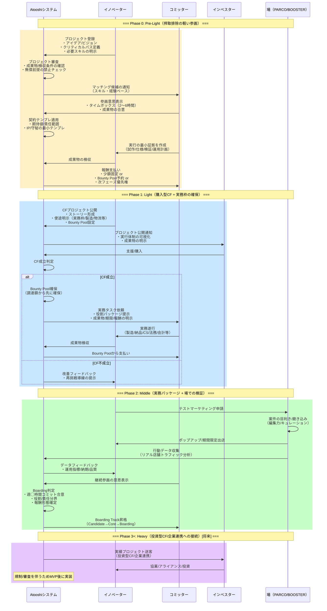
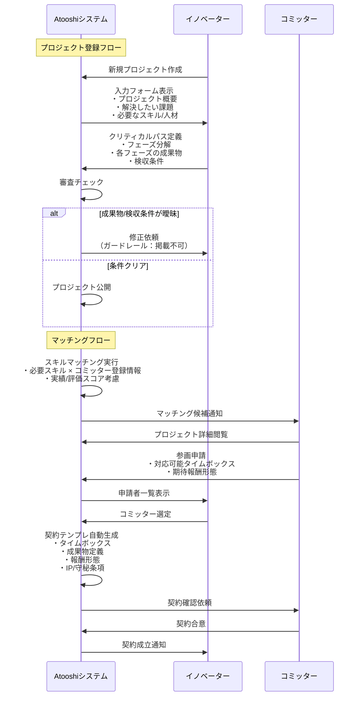
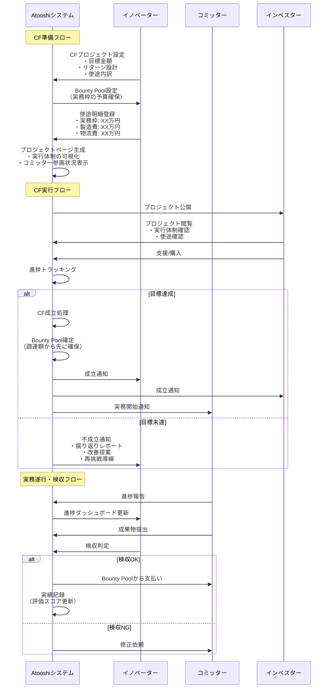
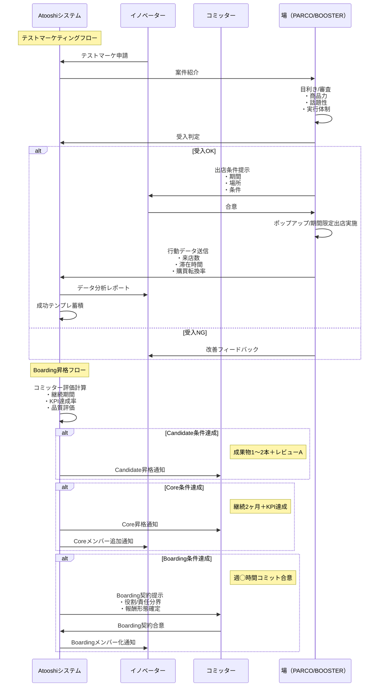
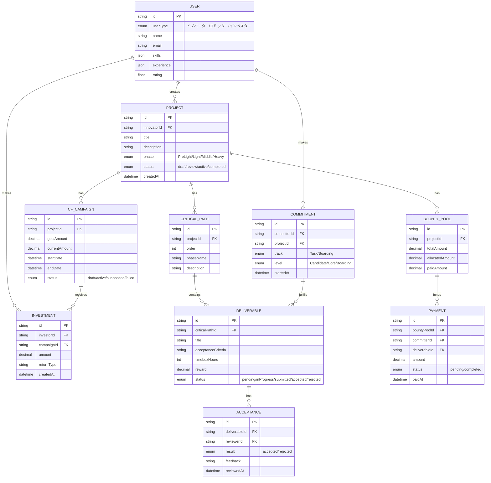
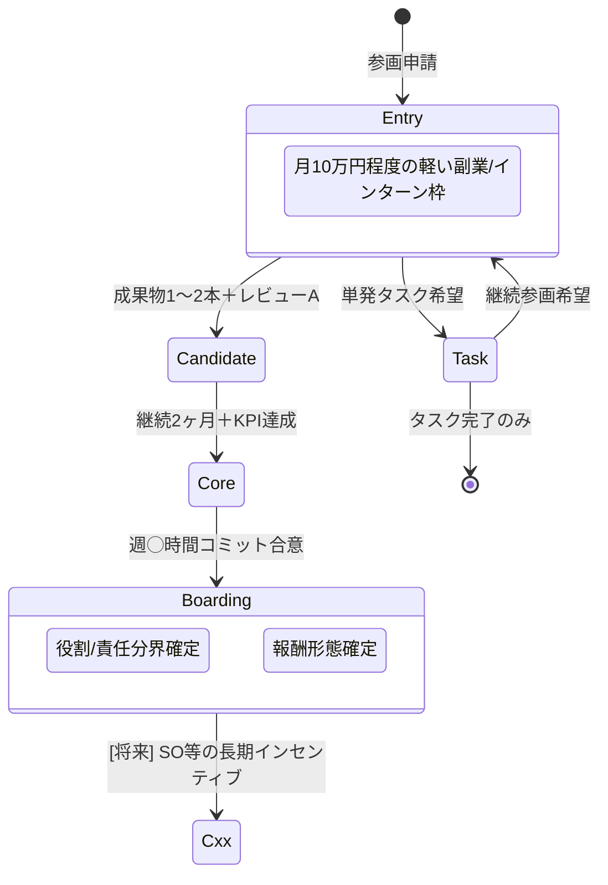
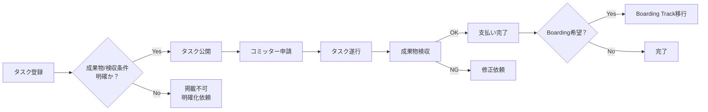

# Atooshi システム設計

## ユーザタイプ定義

| ユーザタイプ | 役割 | 価値提供 |
|------------|------|---------|
| **イノベーター** | プロジェクト起案・実行者 | アイデア・ビジョン・プロジェクト推進力 |
| **コミッター** | 実務遂行を提供する専門職・セカンドキャリア人材 | 専門スキル・経験・実行力（Execution） |
| **インベスター** | 資金提供者・協業パートナー | 資金・販路・アライアンス・ノウハウ |

---

## システムフロー（全体像）

---

## Phase別詳細フロー

### Phase 0: Pre-Light（プロジェクト立ち上げ・マッチング）

### Phase 1: Light（購入型CF + Bounty Pool管理）

### Phase 2: Middle（テストマーケティング + Boarding昇格）

---

## データモデル概要

---

## トラック設計

### Boarding Track（主役）

### Task Track（補助輪）

---

## ガードレール（事故防止機構）

| ガードレール | 対象 | チェックポイント |
|-------------|------|-----------------|
| 成果物明確性チェック | プロジェクト登録時 | 成果物・検収条件が曖昧な案件は掲載不可 |
| 無償前提禁止 | Phase 0 | 0フェーズでの無償稼働を禁止（最小化し明確合意） |
| 雇用化防止 | 全Phase | 指示命令・勤怠管理をプラットフォームが持ちすぎない |
| 使途明示義務 | Phase 1 CF | 支援者に使途と成果物を明示 |
| タイムボックス必須 | Phase 0 マッチング | 2〜6時間のタイムボックスと成果物を必ず定義 |
| 契約テンプレ強制 | 全契約 | 期待値・責任範囲・IP・守秘の最小テンプレを適用 |

---

## 成功の定義

1. **事業化マイルストーン達成**: 資金調達ではなく、納品/運用開始/継続売上の達成
2. **Boardingメンバー化**: コミッターの継続参画の成立
3. **成功テンプレの蓄積**: 再現可能なパターンの蓄積（次案件の成功確度向上）
4. **エコシステム形成**: 成長ベンチャー → 新ベンチャーへの循環（投資/参画の還流）
