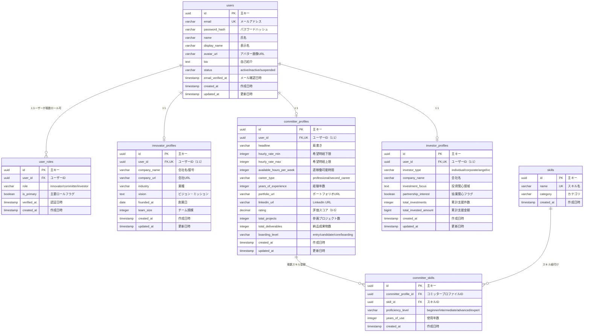
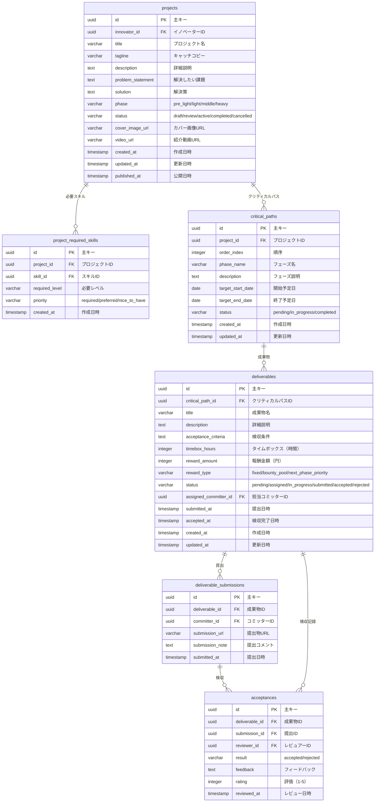
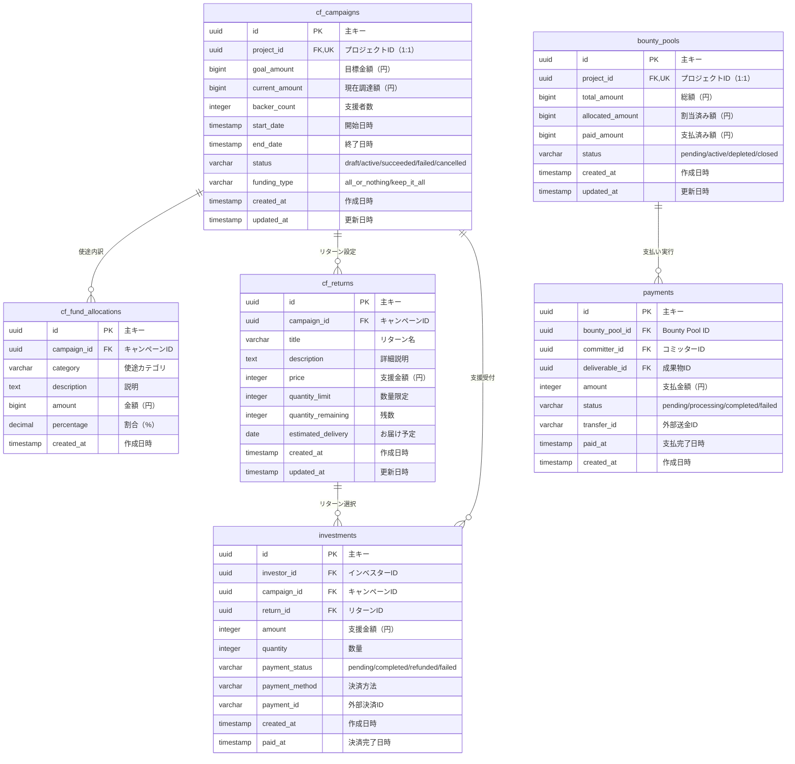
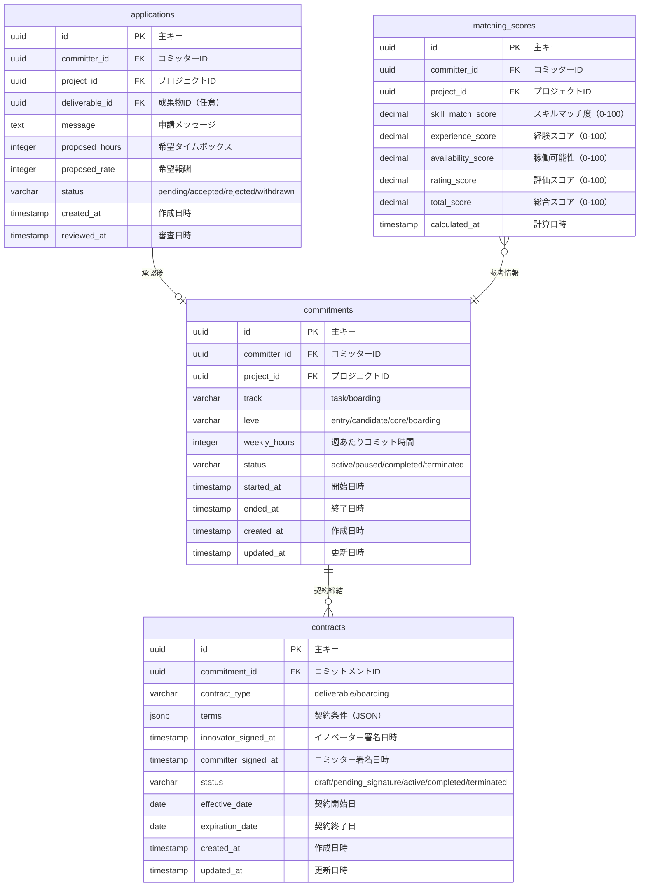
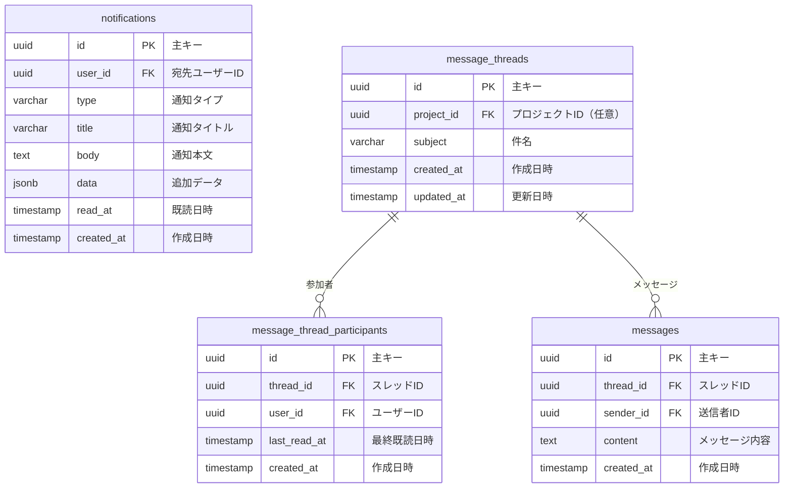

## ER図

```mermaid
erDiagram
    %% ========== ユーザードメイン ==========
    users {
        uuid id PK
        varchar email UK
        varchar password_hash
        varchar name
        varchar display_name
        varchar avatar_url
        text bio
        varchar status
        timestamp email_verified_at
        timestamp created_at
        timestamp updated_at
    }

    user_roles {
        uuid id PK
        uuid user_id FK
        varchar role
        boolean is_primary
        timestamp verified_at
        timestamp created_at
    }

    innovator_profiles {
        uuid id PK
        uuid user_id FK,UK
        varchar company_name
        varchar company_url
        varchar industry
        text vision
        date founded_at
        integer team_size
        timestamp created_at
        timestamp updated_at
    }

    committer_profiles {
        uuid id PK
        uuid user_id FK,UK
        varchar headline
        integer hourly_rate_min
        integer hourly_rate_max
        integer available_hours_per_week
        varchar career_type
        integer years_of_experience
        varchar portfolio_url
        varchar linkedin_url
        decimal rating
        integer total_projects
        integer total_deliverables
        varchar boarding_level
        timestamp created_at
        timestamp updated_at
    }

    investor_profiles {
        uuid id PK
        uuid user_id FK,UK
        varchar investor_type
        varchar company_name
        text investment_focus
        boolean partnership_interest
        integer total_investments
        bigint total_invested_amount
        timestamp created_at
        timestamp updated_at
    }

    skills {
        uuid id PK
        varchar name UK
        varchar category
        timestamp created_at
    }

    committer_skills {
        uuid id PK
        uuid committer_profile_id FK
        uuid skill_id FK
        varchar proficiency_level
        integer years_of_use
        timestamp created_at
    }

    %% ========== プロジェクトドメイン ==========
    projects {
        uuid id PK
        uuid innovator_id FK
        varchar title
        varchar tagline
        text description
        text problem_statement
        text solution
        varchar phase
        varchar status
        varchar cover_image_url
        varchar video_url
        timestamp created_at
        timestamp updated_at
        timestamp published_at
    }

    project_required_skills {
        uuid id PK
        uuid project_id FK
        uuid skill_id FK
        varchar required_level
        varchar priority
        timestamp created_at
    }

    critical_paths {
        uuid id PK
        uuid project_id FK
        integer order_index
        varchar phase_name
        text description
        date target_start_date
        date target_end_date
        varchar status
        timestamp created_at
        timestamp updated_at
    }

    deliverables {
        uuid id PK
        uuid critical_path_id FK
        varchar title
        text description
        text acceptance_criteria
        integer timebox_hours
        integer reward_amount
        varchar reward_type
        varchar status
        uuid assigned_committer_id FK
        timestamp submitted_at
        timestamp accepted_at
        timestamp created_at
        timestamp updated_at
    }

    deliverable_submissions {
        uuid id PK
        uuid deliverable_id FK
        uuid committer_id FK
        varchar submission_url
        text submission_note
        timestamp submitted_at
    }

    acceptances {
        uuid id PK
        uuid deliverable_id FK
        uuid submission_id FK
        uuid reviewer_id FK
        varchar result
        text feedback
        integer rating
        timestamp reviewed_at
    }

    %% ========== CF・決済ドメイン ==========
    cf_campaigns {
        uuid id PK
        uuid project_id FK,UK
        bigint goal_amount
        bigint current_amount
        integer backer_count
        timestamp start_date
        timestamp end_date
        varchar status
        varchar funding_type
        timestamp created_at
        timestamp updated_at
    }

    cf_fund_allocations {
        uuid id PK
        uuid campaign_id FK
        varchar category
        text description
        bigint amount
        decimal percentage
        timestamp created_at
    }

    cf_returns {
        uuid id PK
        uuid campaign_id FK
        varchar title
        text description
        integer price
        integer quantity_limit
        integer quantity_remaining
        date estimated_delivery
        timestamp created_at
        timestamp updated_at
    }

    investments {
        uuid id PK
        uuid investor_id FK
        uuid campaign_id FK
        uuid return_id FK
        integer amount
        integer quantity
        varchar payment_status
        varchar payment_method
        varchar payment_id
        timestamp created_at
        timestamp paid_at
    }

    bounty_pools {
        uuid id PK
        uuid project_id FK,UK
        bigint total_amount
        bigint allocated_amount
        bigint paid_amount
        varchar status
        timestamp created_at
        timestamp updated_at
    }

    payments {
        uuid id PK
        uuid bounty_pool_id FK
        uuid committer_id FK
        uuid deliverable_id FK
        integer amount
        varchar status
        varchar transfer_id
        timestamp paid_at
        timestamp created_at
    }

    %% ========== マッチング・契約ドメイン ==========
    commitments {
        uuid id PK
        uuid committer_id FK
        uuid project_id FK
        varchar track
        varchar level
        integer weekly_hours
        varchar status
        timestamp started_at
        timestamp ended_at
        timestamp created_at
        timestamp updated_at
    }

    applications {
        uuid id PK
        uuid committer_id FK
        uuid project_id FK
        uuid deliverable_id FK
        text message
        integer proposed_hours
        integer proposed_rate
        varchar status
        timestamp created_at
        timestamp reviewed_at
    }

    contracts {
        uuid id PK
        uuid commitment_id FK
        varchar contract_type
        jsonb terms
        timestamp innovator_signed_at
        timestamp committer_signed_at
        varchar status
        date effective_date
        date expiration_date
        timestamp created_at
        timestamp updated_at
    }

    matching_scores {
        uuid id PK
        uuid committer_id FK
        uuid project_id FK
        decimal skill_match_score
        decimal experience_score
        decimal availability_score
        decimal rating_score
        decimal total_score
        timestamp calculated_at
    }

    %% ========== 通知・メッセージドメイン ==========
    notifications {
        uuid id PK
        uuid user_id FK
        varchar type
        varchar title
        text body
        jsonb data
        timestamp read_at
        timestamp created_at
    }

    message_threads {
        uuid id PK
        uuid project_id FK
        varchar subject
        timestamp created_at
        timestamp updated_at
    }

    message_thread_participants {
        uuid id PK
        uuid thread_id FK
        uuid user_id FK
        timestamp last_read_at
        timestamp created_at
    }

    messages {
        uuid id PK
        uuid thread_id FK
        uuid sender_id FK
        text content
        timestamp created_at
    }

    %% ========== リレーション ==========
    users ||--o{ user_roles : "has"
    users ||--o| innovator_profiles : "has"
    users ||--o| committer_profiles : "has"
    users ||--o| investor_profiles : "has"
    users ||--o{ projects : "creates"
    users ||--o{ commitments : "makes"
    users ||--o{ applications : "submits"
    users ||--o{ investments : "makes"
    users ||--o{ notifications : "receives"
    users ||--o{ messages : "sends"
    users ||--o{ message_thread_participants : "participates"
    users ||--o{ deliverable_submissions : "submits"
    users ||--o{ acceptances : "reviews"
    users ||--o{ payments : "receives"
    users ||--o{ matching_scores : "has"

    committer_profiles ||--o{ committer_skills : "has"
    skills ||--o{ committer_skills : "referenced_by"
    skills ||--o{ project_required_skills : "referenced_by"

    projects ||--o{ project_required_skills : "requires"
    projects ||--o{ critical_paths : "has"
    projects ||--o| cf_campaigns : "has"
    projects ||--o| bounty_pools : "has"
    projects ||--o{ commitments : "has"
    projects ||--o{ applications : "receives"
    projects ||--o{ matching_scores : "has"
    projects ||--o{ message_threads : "has"

    critical_paths ||--o{ deliverables : "contains"

    deliverables ||--o{ deliverable_submissions : "has"
    deliverables ||--o{ acceptances : "has"
    deliverables ||--o{ applications : "receives"
    deliverables ||--o{ payments : "triggers"

    deliverable_submissions ||--o{ acceptances : "reviewed_by"

    cf_campaigns ||--o{ cf_fund_allocations : "has"
    cf_campaigns ||--o{ cf_returns : "offers"
    cf_campaigns ||--o{ investments : "receives"

    cf_returns ||--o{ investments : "selected_in"

    bounty_pools ||--o{ payments : "funds"

    commitments ||--o{ contracts : "has"

    message_threads ||--o{ message_thread_participants : "has"
    message_threads ||--o{ messages : "contains"
```

---

### ドメイン別ER図

#### 1. ユーザードメイン

```mermaid
erDiagram
    users {
        uuid id PK "主キー"
        varchar email UK "メールアドレス"
        varchar password_hash "パスワードハッシュ"
        varchar name "氏名"
        varchar display_name "表示名"
        varchar avatar_url "アバター画像URL"
        text bio "自己紹介"
        varchar status "active/inactive/suspended"
        timestamp email_verified_at "メール確認日時"
        timestamp created_at "作成日時"
        timestamp updated_at "更新日時"
    }

    user_roles {
        uuid id PK "主キー"
        uuid user_id FK "ユーザーID"
        varchar role "innovator/committer/investor"
        boolean is_primary "主要ロールフラグ"
        timestamp verified_at "認証日時"
        timestamp created_at "作成日時"
    }

    innovator_profiles {
        uuid id PK "主キー"
        uuid user_id FK,UK "ユーザーID（1:1）"
        varchar company_name "会社名/屋号"
        varchar company_url "会社URL"
        varchar industry "業種"
        text vision "ビジョン・ミッション"
        date founded_at "創業日"
        integer team_size "チーム規模"
        timestamp created_at "作成日時"
        timestamp updated_at "更新日時"
    }

    committer_profiles {
        uuid id PK "主キー"
        uuid user_id FK,UK "ユーザーID（1:1）"
        varchar headline "肩書き"
        integer hourly_rate_min "希望時給下限"
        integer hourly_rate_max "希望時給上限"
        integer available_hours_per_week "週稼働可能時間"
        varchar career_type "professional/second_career"
        integer years_of_experience "経験年数"
        varchar portfolio_url "ポートフォリオURL"
        varchar linkedin_url "LinkedIn URL"
        decimal rating "評価スコア（0-5）"
        integer total_projects "参画プロジェクト数"
        integer total_deliverables "納品成果物数"
        varchar boarding_level "entry/candidate/core/boarding"
        timestamp created_at "作成日時"
        timestamp updated_at "更新日時"
    }

    investor_profiles {
        uuid id PK "主キー"
        uuid user_id FK,UK "ユーザーID（1:1）"
        varchar investor_type "individual/corporate/angel/vc"
        varchar company_name "会社名"
        text investment_focus "投資関心領域"
        boolean partnership_interest "協業関心フラグ"
        integer total_investments "累計支援件数"
        bigint total_invested_amount "累計支援金額"
        timestamp created_at "作成日時"
        timestamp updated_at "更新日時"
    }

    skills {
        uuid id PK "主キー"
        varchar name UK "スキル名"
        varchar category "カテゴリ"
        timestamp created_at "作成日時"
    }

    committer_skills {
        uuid id PK "主キー"
        uuid committer_profile_id FK "コミッタープロファイルID"
        uuid skill_id FK "スキルID"
        varchar proficiency_level "beginner/intermediate/advanced/expert"
        integer years_of_use "使用年数"
        timestamp created_at "作成日時"
    }

    users ||--o{ user_roles : "1ユーザーが複数ロール可"
    users ||--o| innovator_profiles : "1:1"
    users ||--o| committer_profiles : "1:1"
    users ||--o| investor_profiles : "1:1"
    committer_profiles ||--o{ committer_skills : "複数スキル登録"
    skills ||--o{ committer_skills : "スキル紐付け"
```

#### 2. プロジェクトドメイン

```mermaid
erDiagram
    projects {
        uuid id PK "主キー"
        uuid innovator_id FK "イノベーターID"
        varchar title "プロジェクト名"
        varchar tagline "キャッチコピー"
        text description "詳細説明"
        text problem_statement "解決したい課題"
        text solution "解決策"
        varchar phase "pre_light/light/middle/heavy"
        varchar status "draft/review/active/completed/cancelled"
        varchar cover_image_url "カバー画像URL"
        varchar video_url "紹介動画URL"
        timestamp created_at "作成日時"
        timestamp updated_at "更新日時"
        timestamp published_at "公開日時"
    }

    project_required_skills {
        uuid id PK "主キー"
        uuid project_id FK "プロジェクトID"
        uuid skill_id FK "スキルID"
        varchar required_level "必要レベル"
        varchar priority "required/preferred/nice_to_have"
        timestamp created_at "作成日時"
    }

    critical_paths {
        uuid id PK "主キー"
        uuid project_id FK "プロジェクトID"
        integer order_index "順序"
        varchar phase_name "フェーズ名"
        text description "フェーズ説明"
        date target_start_date "開始予定日"
        date target_end_date "終了予定日"
        varchar status "pending/in_progress/completed"
        timestamp created_at "作成日時"
        timestamp updated_at "更新日時"
    }

    deliverables {
        uuid id PK "主キー"
        uuid critical_path_id FK "クリティカルパスID"
        varchar title "成果物名"
        text description "詳細説明"
        text acceptance_criteria "検収条件"
        integer timebox_hours "タイムボックス（時間）"
        integer reward_amount "報酬金額（円）"
        varchar reward_type "fixed/bounty_pool/next_phase_priority"
        varchar status "pending/assigned/in_progress/submitted/accepted/rejected"
        uuid assigned_committer_id FK "担当コミッターID"
        timestamp submitted_at "提出日時"
        timestamp accepted_at "検収完了日時"
        timestamp created_at "作成日時"
        timestamp updated_at "更新日時"
    }

    deliverable_submissions {
        uuid id PK "主キー"
        uuid deliverable_id FK "成果物ID"
        uuid committer_id FK "コミッターID"
        varchar submission_url "提出物URL"
        text submission_note "提出コメント"
        timestamp submitted_at "提出日時"
    }

    acceptances {
        uuid id PK "主キー"
        uuid deliverable_id FK "成果物ID"
        uuid submission_id FK "提出ID"
        uuid reviewer_id FK "レビュアーID"
        varchar result "accepted/rejected"
        text feedback "フィードバック"
        integer rating "評価（1-5）"
        timestamp reviewed_at "レビュー日時"
    }

    projects ||--o{ project_required_skills : "必要スキル"
    projects ||--o{ critical_paths : "クリティカルパス"
    critical_paths ||--o{ deliverables : "成果物"
    deliverables ||--o{ deliverable_submissions : "提出"
    deliverable_submissions ||--o{ acceptances : "検収"
    deliverables ||--o{ acceptances : "検収記録"
```

#### 3. CF・決済ドメイン

```mermaid
erDiagram
    cf_campaigns {
        uuid id PK "主キー"
        uuid project_id FK,UK "プロジェクトID（1:1）"
        bigint goal_amount "目標金額（円）"
        bigint current_amount "現在調達額（円）"
        integer backer_count "支援者数"
        timestamp start_date "開始日時"
        timestamp end_date "終了日時"
        varchar status "draft/active/succeeded/failed/cancelled"
        varchar funding_type "all_or_nothing/keep_it_all"
        timestamp created_at "作成日時"
        timestamp updated_at "更新日時"
    }

    cf_fund_allocations {
        uuid id PK "主キー"
        uuid campaign_id FK "キャンペーンID"
        varchar category "使途カテゴリ"
        text description "説明"
        bigint amount "金額（円）"
        decimal percentage "割合（%）"
        timestamp created_at "作成日時"
    }

    cf_returns {
        uuid id PK "主キー"
        uuid campaign_id FK "キャンペーンID"
        varchar title "リターン名"
        text description "詳細説明"
        integer price "支援金額（円）"
        integer quantity_limit "数量限定"
        integer quantity_remaining "残数"
        date estimated_delivery "お届け予定"
        timestamp created_at "作成日時"
        timestamp updated_at "更新日時"
    }

    investments {
        uuid id PK "主キー"
        uuid investor_id FK "インベスターID"
        uuid campaign_id FK "キャンペーンID"
        uuid return_id FK "リターンID"
        integer amount "支援金額（円）"
        integer quantity "数量"
        varchar payment_status "pending/completed/refunded/failed"
        varchar payment_method "決済方法"
        varchar payment_id "外部決済ID"
        timestamp created_at "作成日時"
        timestamp paid_at "決済完了日時"
    }

    bounty_pools {
        uuid id PK "主キー"
        uuid project_id FK,UK "プロジェクトID（1:1）"
        bigint total_amount "総額（円）"
        bigint allocated_amount "割当済み額（円）"
        bigint paid_amount "支払済み額（円）"
        varchar status "pending/active/depleted/closed"
        timestamp created_at "作成日時"
        timestamp updated_at "更新日時"
    }

    payments {
        uuid id PK "主キー"
        uuid bounty_pool_id FK "Bounty Pool ID"
        uuid committer_id FK "コミッターID"
        uuid deliverable_id FK "成果物ID"
        integer amount "支払金額（円）"
        varchar status "pending/processing/completed/failed"
        varchar transfer_id "外部送金ID"
        timestamp paid_at "支払完了日時"
        timestamp created_at "作成日時"
    }

    cf_campaigns ||--o{ cf_fund_allocations : "使途内訳"
    cf_campaigns ||--o{ cf_returns : "リターン設定"
    cf_campaigns ||--o{ investments : "支援受付"
    cf_returns ||--o{ investments : "リターン選択"
    bounty_pools ||--o{ payments : "支払い実行"
```

#### 4. マッチング・契約ドメイン

```mermaid
erDiagram
    applications {
        uuid id PK "主キー"
        uuid committer_id FK "コミッターID"
        uuid project_id FK "プロジェクトID"
        uuid deliverable_id FK "成果物ID（任意）"
        text message "申請メッセージ"
        integer proposed_hours "希望タイムボックス"
        integer proposed_rate "希望報酬"
        varchar status "pending/accepted/rejected/withdrawn"
        timestamp created_at "作成日時"
        timestamp reviewed_at "審査日時"
    }

    matching_scores {
        uuid id PK "主キー"
        uuid committer_id FK "コミッターID"
        uuid project_id FK "プロジェクトID"
        decimal skill_match_score "スキルマッチ度（0-100）"
        decimal experience_score "経験スコア（0-100）"
        decimal availability_score "稼働可能性（0-100）"
        decimal rating_score "評価スコア（0-100）"
        decimal total_score "総合スコア（0-100）"
        timestamp calculated_at "計算日時"
    }

    commitments {
        uuid id PK "主キー"
        uuid committer_id FK "コミッターID"
        uuid project_id FK "プロジェクトID"
        varchar track "task/boarding"
        varchar level "entry/candidate/core/boarding"
        integer weekly_hours "週あたりコミット時間"
        varchar status "active/paused/completed/terminated"
        timestamp started_at "開始日時"
        timestamp ended_at "終了日時"
        timestamp created_at "作成日時"
        timestamp updated_at "更新日時"
    }

    contracts {
        uuid id PK "主キー"
        uuid commitment_id FK "コミットメントID"
        varchar contract_type "deliverable/boarding"
        jsonb terms "契約条件（JSON）"
        timestamp innovator_signed_at "イノベーター署名日時"
        timestamp committer_signed_at "コミッター署名日時"
        varchar status "draft/pending_signature/active/completed/terminated"
        date effective_date "契約開始日"
        date expiration_date "契約終了日"
        timestamp created_at "作成日時"
        timestamp updated_at "更新日時"
    }

    applications ||--o| commitments : "承認後"
    matching_scores }o--|| commitments : "参考情報"
    commitments ||--o{ contracts : "契約締結"
```

#### 5. 通知・メッセージドメイン

```mermaid
erDiagram
    notifications {
        uuid id PK "主キー"
        uuid user_id FK "宛先ユーザーID"
        varchar type "通知タイプ"
        varchar title "通知タイトル"
        text body "通知本文"
        jsonb data "追加データ"
        timestamp read_at "既読日時"
        timestamp created_at "作成日時"
    }

    message_threads {
        uuid id PK "主キー"
        uuid project_id FK "プロジェクトID（任意）"
        varchar subject "件名"
        timestamp created_at "作成日時"
        timestamp updated_at "更新日時"
    }

    message_thread_participants {
        uuid id PK "主キー"
        uuid thread_id FK "スレッドID"
        uuid user_id FK "ユーザーID"
        timestamp last_read_at "最終既読日時"
        timestamp created_at "作成日時"
    }

    messages {
        uuid id PK "主キー"
        uuid thread_id FK "スレッドID"
        uuid sender_id FK "送信者ID"
        text content "メッセージ内容"
        timestamp created_at "作成日時"
    }

    message_threads ||--o{ message_thread_participants : "参加者"
    message_threads ||--o{ messages : "メッセージ"
```

---