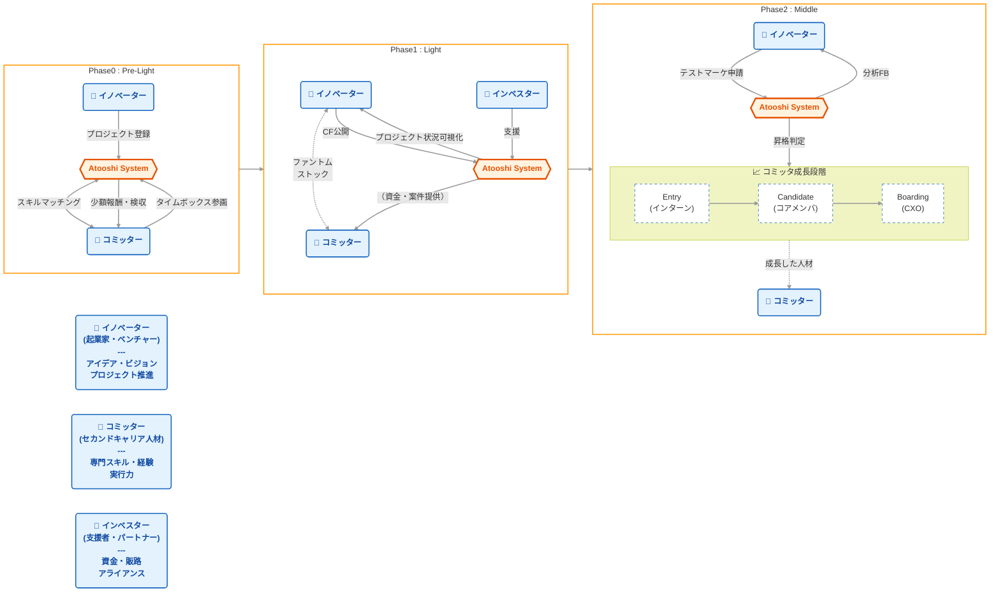

```mermaid
graph LR
    %% --- スタイル定義 ---
    classDef default fill:#fff,stroke:#666,stroke-width:1px;
    classDef person fill:#e3f2fd,stroke:#1565c0,stroke-width:2px,color:#0d47a1,font-weight:bold;
    classDef atooshi fill:#fff3e0,stroke:#e65100,stroke-width:3px,color:#e65100,font-weight:bold,shape:hex;
    classDef phaseBox fill:#fafafa,stroke:#ff9800,stroke-width:3px,color:#e65100;
    classDef growthStep fill:#fff,stroke:#1565c0,stroke-width:1px,stroke-dasharray: 5 5;
    linkStyle default stroke:#999,stroke-width:2px,fill:none;

    %% =========================================
    %% 上段：登場人物の定義（サブグラフで表現）
    %% =========================================
    subgraph Definitions [" "]
        direction LR
        style Definitions fill:none,stroke:none;
        D_Innovator("👤 イノベーター<br/>(起業家・ベンチャー)<br/>---<br/>アイデア・ビジョン<br/>プロジェクト推進"):::person
        D_Committer("👤 コミッター<br/>(セカンドキャリア人材)<br/>---<br/>専門スキル・経験<br/>実行力"):::person
        D_Investor("👤 インベスター<br/>(支援者・パートナー)<br/>---<br/>資金・販路<br/>アライアンス"):::person
    end

    %% =========================================
    %% 中段：フェーズの進行フロー
    %% =========================================
    
    %% --- Phase 0: Pre-Light ---
    subgraph P0 ["Phase0 : Pre-Light"]
        style P0 fill:#fff,stroke:#ff9800,stroke-width:2px;
        direction TB
        P0_Innovator(👤 イノベーター):::person
        P0_Atooshi{{Atooshi System}}:::atooshi
        P0_Committer(👤 コミッター):::person

        P0_Innovator -->|プロジェクト登録| P0_Atooshi
        P0_Atooshi <-->|スキルマッチング| P0_Committer
        P0_Committer -->|タイムボックス参画| P0_Atooshi
        P0_Atooshi -->|少額報酬・検収| P0_Committer
    end

    %% --- Phase 1: Light ---
    subgraph P1 ["Phase1 : Light"]
        style P1 fill:#fff,stroke:#ff9800,stroke-width:2px;
        direction TB
        
        subgraph P1_Top [" "]
            direction LR
            style P1_Top fill:none,stroke:none;
            P1_Innovator(👤 イノベーター):::person
            P1_Committer(👤 コミッター):::person
            %% 図中の「ファントムストック」のやり取りを表現
            P1_Innovator <.->|ファントム<br/>ストック| P1_Committer
        end
        
        P1_Atooshi{{Atooshi System}}:::atooshi
        P1_Investor(👤 インベスター):::person

        P1_Innovator -->|CF公開| P1_Atooshi
        P1_Investor -->|支援| P1_Atooshi
        P1_Atooshi -->|プロジェクト状況可視化| P1_Innovator
        P1_Atooshi -->|（資金・案件提供）| P1_Committer
    end

    %% --- Phase 2: Middle ---
    subgraph P2 ["Phase2 : Middle"]
        style P2 fill:#fff,stroke:#ff9800,stroke-width:2px;
        direction TB
        P2_Innovator(👤 イノベーター):::person
        P2_Atooshi{{Atooshi System}}:::atooshi
        P2_Committer(👤 コミッター):::person
        
        P2_Innovator -->|テストマーケ申請| P2_Atooshi
        P2_Atooshi -->|分析FB| P2_Innovator

        %% コミッタ成長段階の表現（左から右へのフローで代替）
        subgraph Growth ["📈 コミッタ成長段階"]
            style Growth fill:#f0f4c3,stroke:#c0ca33;
            direction LR
            G_Entry["Entry<br/>(インターン)"]:::growthStep --> G_Candidate["Candidate<br/>(コアメンバ)"]:::growthStep
            G_Candidate --> G_Boarding["Boarding<br/>(CXO)"]:::growthStep
        end
        
        P2_Atooshi -->|昇格判定| Growth
        Growth -.->|成長した人材| P2_Committer
    end

    %% フェーズ間の大きな流れ
    P0 ==> P1
    P1 ==> P2

    %% =========================================
    %% 下段：まとめメッセージ（注釈として表示）
    %% =========================================
    %% Mermaid図内には含められないため、図の下にテキストで記載します。
```